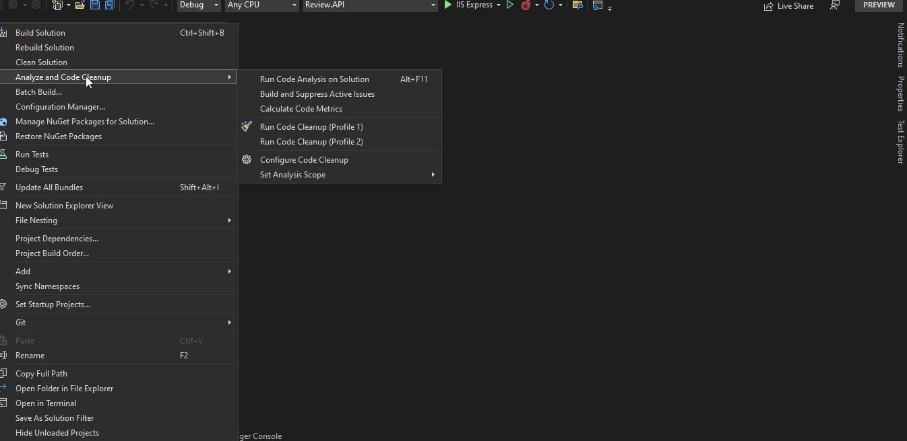

# About Product Microservices

  This solution has been prepared for Beerwulf organization's [Beerwulf.Assessment Github project](https://github.com/Beerwulf/Beerwulf.Assessment). The project has been prepared in accordance with the layered microservice architecture. All microservices are accessible under the **Microservices** folder in the solution. **Review.API** project has been designed as a gateway project. The **Review.API** project can also be used as middleware for another internal web project. The [Ocelot](https://github.com/ThreeMammals/Ocelot) library has been used to prepare the microservices, and the [SwaggerForOcelot](https://github.com/Burgyn/MMLib.SwaggerForOcelot) library has been used for documentation.  The configuration of the entire microservice architecture can be seen from the **ocelot.json** file which is located in the root path. All CRUD operations are included in the microservices, even if they will not be used. **ApplicationDBContexts** has been prepared in accordance with EF Core InMemory structure. In addition, **DataGenerator** classes has been included for dummy data. Database elements are as simple as possible in a non-relational database structure (So it can be easily convert to a non-relational NoSQL database), and It can be seen under the **Entities** folder. For **User** as entity, the point that I need to specify has not been prepared in accordance with any Identification, Authentication structure, it is completely fake. Request that are coming from gateway over microservices has been created with the help of traditional HttpClient, but it is necessary to use a gRPC-like protocol in real-time project. In general, the structure is available to be extended horizontally and vertically and to be worked independently by different groups.

  The **Review.API** project is as simple as possible. With the help of **Aggregators**, as I mentioned before, access to microservices has been provided with the help of HttpClient. Cache has been used, so quick callbacks can be obtained after the first query.
  
  Only 3 basic methods has been prepared in the test project. In one of them, can be inspect to comparison between the review summary and the review.
  
  All these descriptions and definitions also can be found inside the main swagger document.
  
# Preparation

You should select multiple projects as startup project before build and run. A demonstration has been Added below.

## License

DIYI is licensed under the [MIT license](LICENSE.TXT).
